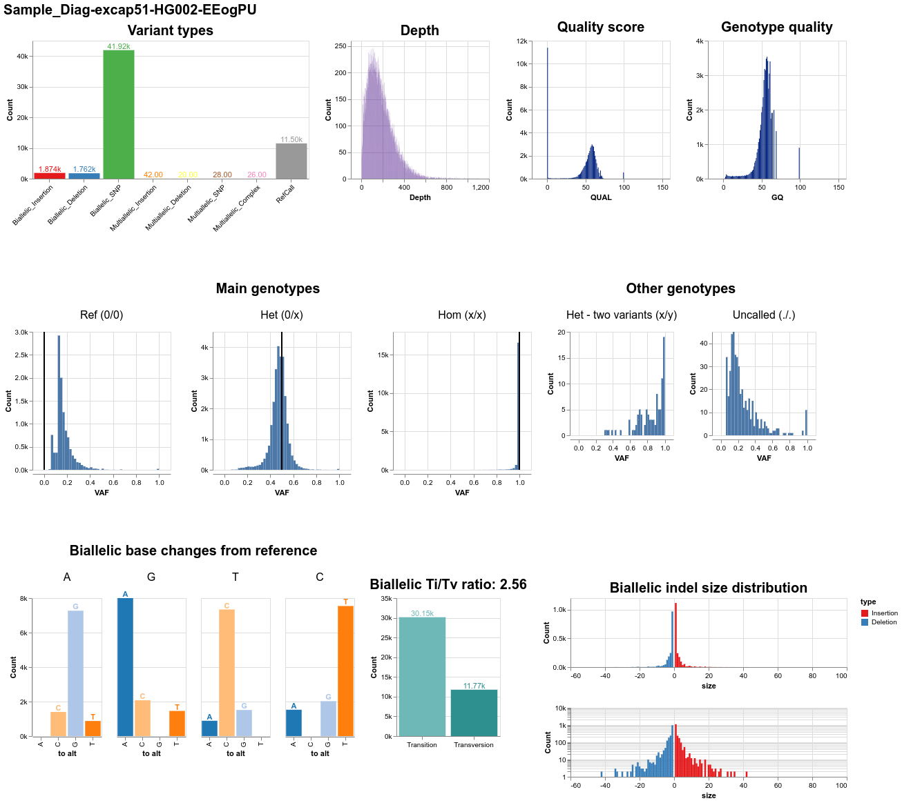
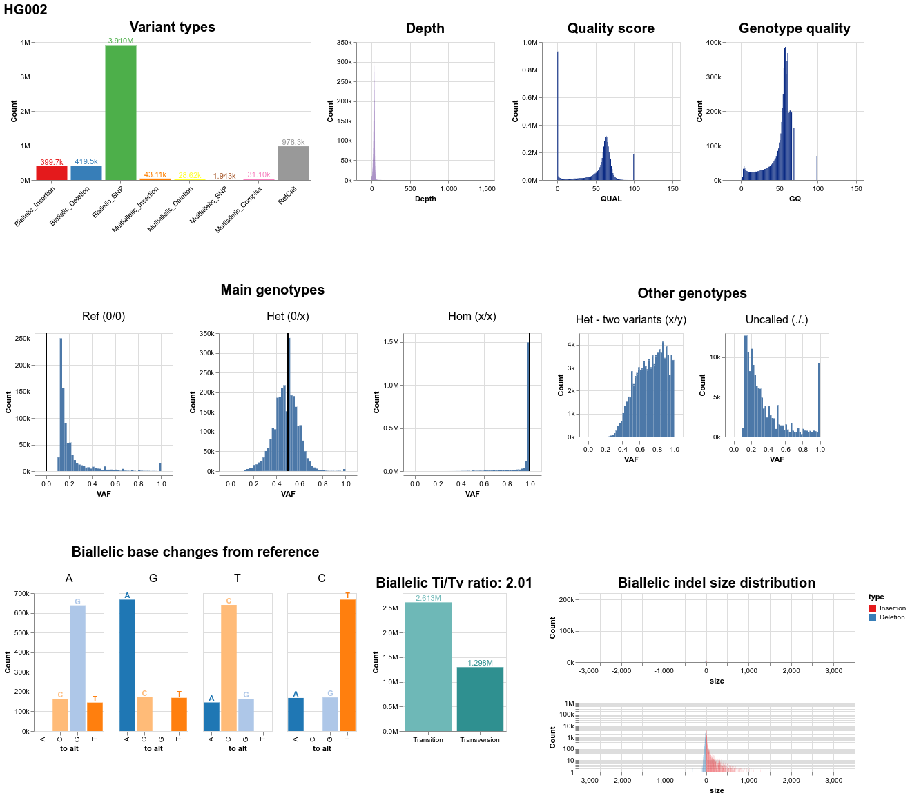

# VCF stats report

This is an introduction to the VCF stats report: how to create one and how to
read it. The VCF stats report includes visualizations on several overall
statistics from a VCF file (output of DeepVariant).

## How to create a VCF stats report

For new DeepVariant runs, this report is included in the outputs by default (to
turn this off, add a --novcf_stats_report flag). For previous DeepVariant runs
you can generate a report for an existing VCF file using the vcf_stats_report
binary:

```bash
sudo docker run \
  -v "${DATA_DIR}:/input" \
  -v "${OUTPUT_DIR}:/output" \
  google/deepvariant:"${BIN_VERSION}" \
  /opt/deepvariant/bin/vcf_stats_report \
  --input_vcf /input/${INPUT_VCF} \
  --outfile_base /output/${OUTPUT}
```

This creates one output file: `${OUTPUT}.visual_report.html`

## How to read the VCF stats report


Here we walk through all the charts to discuss how they are generated and how to
interpret them.

### Variant types

Insertions have ALT longer than REF, where deletions are the opposite. SNPs have
both ALT and REF of one base. Biallelic variants are those where there is only
one alternate allele, while multiallelic variants have more than one alternate
allele. Each variant is only counted once. Multi-allelic variants will be listed
as “Mutliallelic_Deletion/Insertion/SNP” only if all alternate alleles are of
the same type (e.g. all insertions) or as “Multiallelic_Complex” if not all
alleles are of the same type. RefCalls are candidates that were determined to
match the reference and are therefore not variants, although they are included
in the VCF file (see FILTER column).

### Depth

This chart contains a histogram of depths, which come from the DP sub-column of
the VCF file. All entries in the VCF are included in this chart, including
RefCalls. Any entries without a DP are ignored.

### Quality score

This is the QUAL column of the VCF file. See the [VCF specification] for how
this is calculated, but in short, a high QUAL score indicates a low probability
that the call shown in ALT is wrong. This chart shows quality scores from all
rows of the VCF file, including RefCalls.

### Genotype quality

These numbers come from the GQ sub-column, listed in the FORMAT column of the
VCF file. An important distinction here is that if the variant-caller is very
sure that the variant is there, but not sure if it is heterozygous or
homozygous, the QUAL score can be very high, but the genotype quality score (GQ)
can be low. GQ is on a Phred scale, calculated as -10*log10(probability that the
genotype is wrong). Any entries without a GQ are ignored.

### Variant allele frequency for all genotypes

The histograms show the variant allele frequency (VAF) distributions for
different genotypes. Black guiding lines are shown to indicate the theoretical
VAF for the main genotypes. For example heterozygous variants should have about
as many variant-supporting as reference-supporting reads, for a VAF of 0.5. The
reference calls will not usually show a VAF as low as 0 because otherwise they
wouldn’t have been flagged as candidates in the first place. The genotypes are
based on the GT sub-column and consolidated. For example, 0/1 and 0/2 both
become Het (0/x). 1/1 and 3/3 are Hom (x/x). Het - both variants (x/y) includes
all calls with two different alternate alleles, such as 1/2 or 3/5.

### Biallelic base changes

Of all biallelic SNPs, this shows the counts from a particular REF (along the
top labeling the four charts) to a particular ALT (each bar within the charts
labeled at the bottom). See the Ti/Tv section for a brief explanation of why
some of these base changes tend to be more frequent than others. RefCalls and
multi-allelic variants are not included.

### Biallelic Ti/Tv ratio

Transition (Ti) count is the number of biallelic SNPs going from purine->purine
or pyrimidine->pyrimidine, where purines are A and G, pyrimidines are C and T.
Transversions (Tv) are purine->pyrimidine or pyrimidine->purine. Transitions
are biologically more likely to occur than transversions due to the molecular
structure of the bases, so a ratio well above one is desirable. This
[article](https://gatkforums.broadinstitute.org/gatk/discussion/6308/evaluating-the-quality-of-a-variant-callset)
on the GATK forums has a good discussion of how to interpret the ratio. These
include all biallelic SNPs, excluding RefCalls.

### Biallelic indel size distribution

The sizes of all biallelic insertions and deletions are shown as histograms. The
top and bottom plots show the same data, just on a linear scale on top and on a
log scale on the bottom. RefCalls and multi-allelic variants are not included.

## Examples

### WGS case study HG002 (DeepVariant v0.9.0)


### WES case study HG002 (DeepVariant v0.9.0)



### PacBio case study HG002 (DeepVariant v0.9.0)



[VCF specification]: https://samtools.github.io/hts-specs/VCFv4.3.pdf
